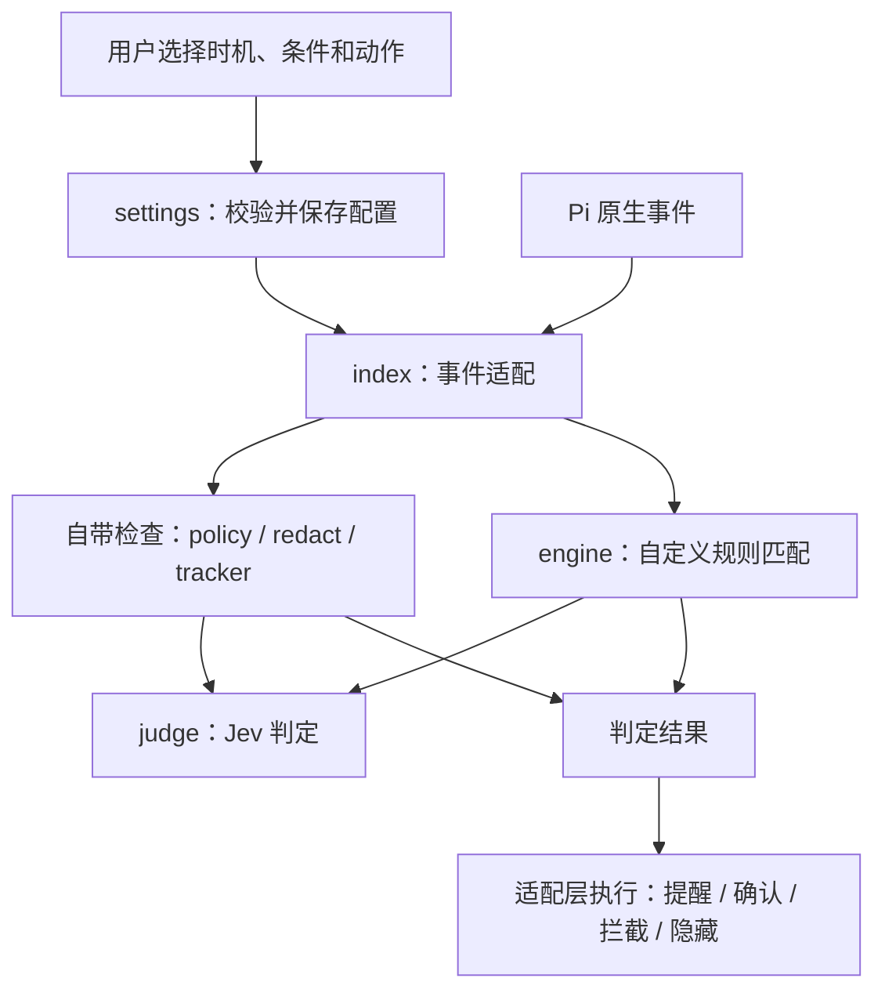

# 可配置的 Pi Guard

## 源码对比

2026-09-19 直接读取了以下仓库源码；没有安装或运行这些第三方插件，因此以下是结构分析，不是效果排名。

| 来源 | 实现方式 | 对本项目的启发 |
| --- | --- | --- |
| [pi-warden 0.26.0](https://github.com/DevMortimer/pi-warden/tree/e6c801679464b1a9624225114eb5fb443c27d823) | `src/extension.ts` 接 Pi 事件；`guard.ts`、`rules.ts`、`stuck.ts`、`done.ts`、`output.ts` 分开实现；`src/index.ts` 导出核心 API；`config.ts` 处理用户配置和受信任项目配置；`/warden` 提供配置与跟踪入口 | 判断模块与宿主适配分离；自带检查独立开关；用户能够看到配置和触发情况 |
| [pi-jev](https://github.com/y0usaf/pi-jev/tree/b3478fd4ca1ac8ffcb703f6dc8d6069b555f531e) | `gate.ts` 与 `output.ts` 分开；`config.ts` 合并默认、用户、项目设置；可指定工具范围、阈值、shadow/enforce、无 UI 行为 | 不把所有工具与阶段混在一个开关里；阶段有不同能力；失败策略和无 UI 行为要明确 |
| Pi 0.85.1 随包文档与官方示例 | `pi.extensions` 声明入口；默认函数注册 `pi.on`、`pi.registerCommand`；`tool_call` 返回阻止标志，`tool_result` 修改结果；核心包用 peer dependency；示例直接使用 `ctx.ui` | 遵循原生事件协议，不修改 Pi 核心；包入口与依赖按官方约定声明 |

参考文件：[pi-warden 配置](https://github.com/DevMortimer/pi-warden/blob/e6c801679464b1a9624225114eb5fb443c27d823/src/config.ts)、[pi-warden 适配层](https://github.com/DevMortimer/pi-warden/blob/e6c801679464b1a9624225114eb5fb443c27d823/src/extension.ts)、[pi-jev 配置](https://github.com/y0usaf/pi-jev/blob/b3478fd4ca1ac8ffcb703f6dc8d6069b555f531e/src/config.ts)、[Pi 扩展文档](https://github.com/earendil-works/pi/blob/main/packages/coding-agent/docs/extensions.md)、[Pi 包文档](https://github.com/earendil-works/pi/blob/main/packages/coding-agent/docs/packages.md)。本地官方文档版本为 0.85.1，main 链接后续可能更新。

## 当前结构

- **宿主适配层**负责 Pi 事件、交互确认、会话状态和提醒。不让判断器直接执行工具或操作 UI。
- **自定义规则执行器**只接收标准事件数据、规则、可注入的 Judge，输出 finding。它不导入 Pi，未来可由另一个宿主适配器调用。
- **自带检查**保留明确语义：危险操作检查在执行前，脱敏在结果阶段，缺少验证在收尾阶段。统一登记 ID、时机和开关，但不强行把证据追踪变成一句概率问题。
- **配置层**严格检查字段和事件／动作组合。配置错误不能通过忽略未知字段而悄悄关闭规则。
- **Jev 层**使用官方 SDK，负责传输、取消和响应校验；不决定 Pi 能否继续执行。

## 一条规则的处理过程

例如“运行 npm publish 前确认”：

1. 用户运行 `/jevguard add`，选择 `tool_call`、本地文本包含、`npm publish`、`confirm`，填写说明。
2. 插件校验规则，保存到用户配置文件，之后的启动也会加载它。
3. Pi 发出 `tool_call`。自带检查先判断，自定义规则匹配事件及参数。
4. 本地匹配不访问 Jev；设置了 `question` 的规则才请求 Jev。匹配的自定义问题在同一事件中批量提交。
5. 适配层处理结果。拒绝、关闭窗口、无交互界面或等待期间取消都不会算同意。每次确认仅适用于当前事件。
6. 跟踪中记录规则 ID 与动作，不保存完整参数或返回内容。

普通规则可在四个时机间配置；不合法的组合会被拒绝。结果阶段的 `hide` 是替换最终内容及元数据，不是撤销执行。回答结束后的 `warn` 不能保证用户之前没有看到回答。

## 已实现与后续范围

0.2.0 已实现四个时机、六项自带检查开关、交互添加、JSON 高级编辑、持久化、重载、本地选择器、自定义 Jev 问题与失败策略。自定义规则不能通过 allow 覆盖其他检查；观察模式仍保留已启用的输出处理。

目前没有提供任意第三方 JavaScript 检查器加载、可执行 shell 回调、所有 Pi 事件的通用注册 UI、DSH 适配或规则商城。核心接口在源码中可复用，但尚未作为独立的稳定 SDK 发布。没有自动信任仓库配置；需要项目专用配置时，由用户明确设置 `JEV_GUARD_CONFIG`。

这是经过接口和行为测试的实验性实现。真实 Jev 判定效果、TUI 真人操作、误报率和长期运行仍需验证。

0.2.1 新增 `/jevguard login` 和 `/jevguard logout`。凭据独立保存在 Pi 用户目录中；隐藏输入和原子写入位于 `src/auth.ts`，验证后在当前会话替换 Judge，不要求重启。
